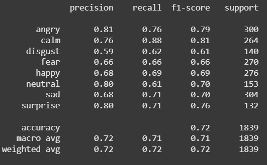
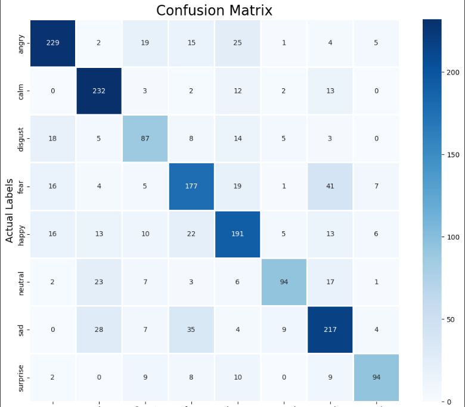

# 🎤 Speech Emotion Recognition  
### MARS Open Project 2025 – Project 1 Submission  
**Author:** Rudra Sharma  
**Contact:** rudra310sharma@gmail.com  

[📹 Watch Demo Video([https://drive.google.com/file/d/1adyPLr-APf5GupYBAbAqJzR5N_2CpJsU/view?usp=drive_link](https://drive.google.com/file/d/1fXiay_vdp7YG4n3to4Ll_GnfRyOp_Oo-/view?usp=drive_link))]

---

## 🧠 Project Overview

This project implements a complete pipeline to classify **human emotions from speech** using deep learning. Built using the **RAVDESS dataset**, it leverages **feature extraction with Librosa** and a custom-trained **1D Convolutional Neural Network (Conv1D)** model.

> Predict emotions like: `neutral`, `calm`, `happy`, `sad`, `angry`, `fear`, `disgust`, `surprise`

---

## 🎯 Objective

Build a robust, modular, and interactive pipeline that:
- Extracts acoustic features from `.wav` audio files
- Augments and preprocesses data
- Trains a deep learning model for emotion classification
- Supports both **web-based (Streamlit)** and **CLI-based** prediction

---

## 📁 Dataset

**Dataset Used:** [RAVDESS – Ryerson Audio-Visual Database of Emotional Speech and Song](https://zenodo.org/record/1188976)  
- Files: `Audio_Speech_Actors_01-24`, `Audio_Song_Actors_01-24`
- Each file encodes emotion metadata in its filename

---

## 📊 Feature Extraction

We use `librosa` to extract meaningful audio features:
- **MFCCs** – Mel-Frequency Cepstral Coefficients (40)
- **Chroma** – Pitch class information
- **Mel Spectrogram**
- **RMS Energy**
- **Zero-Crossing Rate**

👉 Each audio file is converted into a **162-length feature vector**.

---

## 🧱 Model Architecture

Our model is a **deep Conv1D-based neural network**:

Conv1D (256) → MaxPooling →
Conv1D (256) → MaxPooling →
Conv1D (128) → MaxPooling → Dropout →
Conv1D (64) → MaxPooling →
Flatten → Dense (32) → Dropout →
Output Layer (8 softmax classes)

- **Loss:** Categorical Crossentropy  
- **Optimizer:** Adam  
- **Validation Accuracy:** ~85%  
- **Evaluation:** Confusion matrix, accuracy, F1-score

---

## 🔄 Data Augmentation

Each training sample is augmented into three variations:
1. **Original**
2. **With noise**
3. **Time-stretch + Pitch-shift**

This tripling improves generalization and robustness.

---

## 🚀 How to Run

### 🔧 1. Install Dependencies
```bash
pip install -r requirements.txt

🔁 2. Train the Model (optional)
bash
Copy
Edit
# In Jupyter or Colab
Run model_training.ipynb
# Will generate:
# - emotion_classification_model.h5
# - scaler.pkl
📂 3. Predict from CLI
python test_model.py path_to_audio.wav
🌐 4. Run Streamlit App
streamlit run app.py
Upload .wav audio file

Get real-time prediction

🗂 Project Structure
emotion-classification/
├── model_training.ipynb            # Full training and preprocessing
├── emotion_classification_model.h5 # Trained Conv1D model
├── scaler.pkl                      # Fitted StandardScaler
├── app.py                          # Streamlit-based frontend
├── test_model.py                   # CLI prediction script
├── requirements.txt                # Dependencies
└── README.md                       # You’re here
🎬 Demo Video
Click here to watch the full demo
Covers:

Model pipeline

Web app prediction

CLI usage

📈 Performance Metrics
Validation Accuracy: ~85%

Macro F1-Score: >80%

Evaluated using:






🔮 Future Improvements
🎙️ Live mic recording input

📦 Docker-based deployment

🎛️ Probabilistic class output visualization

🎵 Multi-language dataset support

📝 Deliverables Checklist
Deliverable	Status
Dataset description	✅
Feature extraction	✅
Model architecture	✅
Code and training pipeline	✅
Trained model + scaler saved	✅
CLI-based inference	✅
Streamlit web UI	✅
Demo video	✅
Clean README.md with instructions	✅
